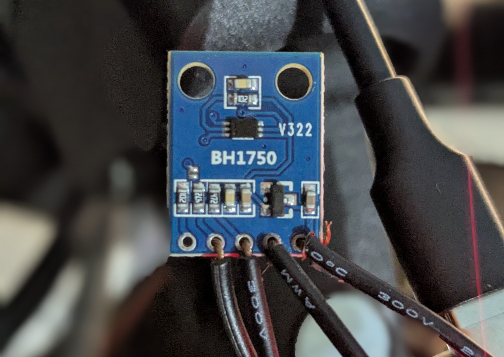

# ddcutil-bh1750
A simple ddcutil daemon that automatically adjust your monitor DDC/CI over I²C brightness using ddcutil according to the lux data from the arduino serial.

## Hardware
You'll need a light sensor module integrated circuit. Specifically model BH1750. It communicates with the arduino also coincidentally using I²C. 

I used Pro Micro ATmega32U4. The light sensor module pin SDA goes to pin 2, and pin SCL to pin 3. If your board is somewhat different, you may need to look up for your board's I²C pin layout.



## Dependencies

### For system
`ddcutil-devel` or `ddcutil`, and `arduino-cli`.

### For arduino
Install the core stuff and necessary header/library for the light module.
```sh
$ arduino-cli core install <your-board>
$ arduino-cli lib install BH1750
```
`<your-board>` is what board you have. Mine for example is `arduino:avr`. You might vary.

## Building
Building the daemon, and the .ino
```sh
$ BOARD=<your-board> make build
```
`<your-board>` is what board you have. Mine for example is `arduino:avr:leonardo`. You might vary.

## Uploading
Upload to the board
```sh
$ BOARD=<your-board> PORT=<your-board> make upload
```
`<port>` is where the kernel assign the device. Mine for example is `/dev/serial/by-id/usb-Arduino_LLC_Arduino_Leonardo-XXXX`. You might vary.

## Running/Installing the daemon
Run this to see the verbose output.
```sh
$ ./ddcutil-bh1750-debug
```
If you see output and your monitor changing its brightness, then continue.

This will install it on /usr/bin/
```sh
# make install
```

Run it. Or...
```sh
# ddcutil-bh1750
```

Lastly if you're using systemd do this.
```sh
$ make init
$ systemctl --user enable --now ddcutil-bh1750.service
```

## As of right now
* The code is simple and that's good, but the logic for the auto-brightness is pretty barebone.
* You make your own init's, if you're using other than systemd. And only runs on graphical sessions.
* The code is still prone to exiting if certain error occured.
